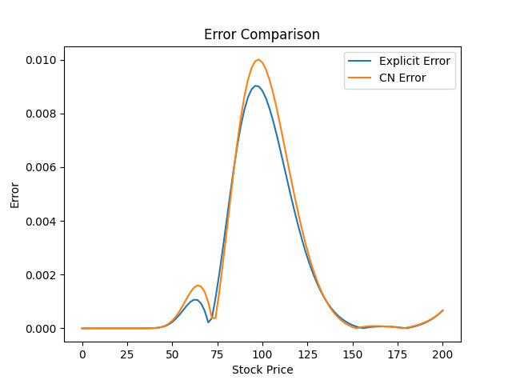
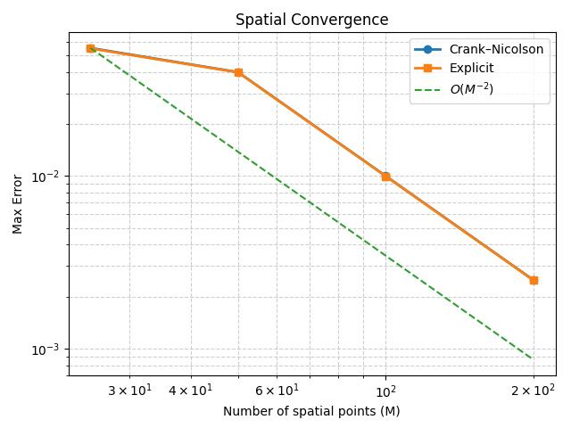
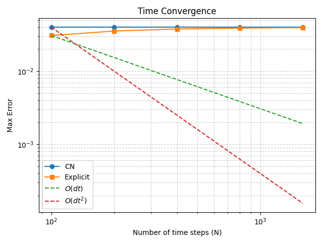
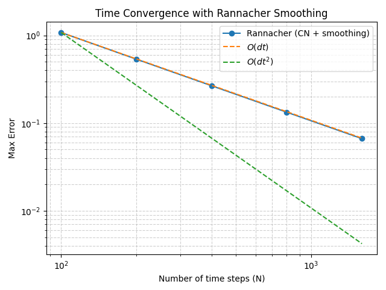

# Black–Scholes PDE Solver

Finite difference implementation of the Black–Scholes partial differential equation for European option pricing, with detailed analysis of numerical accuracy, stability, and convergence properties.

---

## Overview

This project implements and compares several finite difference schemes for solving the Black–Scholes PDE:

- Explicit finite difference scheme
- Crank–Nicolson scheme
- Crank–Nicolson with Rannacher smoothing

The numerical solutions are validated against the analytical Black–Scholes formula. The project includes a detailed study of:

- Spatial convergence
- Time convergence
- Stability properties
- Impact of payoff regularity

---

## Key Results

- Second-order spatial convergence confirmed
- Explicit scheme instability demonstrated
- Time convergence limited by payoff regularity
- Rannacher smoothing improves temporal behavior

---

## Mathematical Model

The Black–Scholes PDE is given by:

$$
\frac{\partial V}{\partial t} + \frac{1}{2} \sigma^2 S^2 \frac{\partial^2 V}{\partial S^2} + r S \frac{\partial V}{\partial S} - r V = 0
$$

### Terminal condition

$V(S, T) = \max(S - K, 0)$

### Boundary conditions

- $V(0, t) = 0 \$
- $V(S_{\max}, t) \approx S_{\max} - K e^{-r(T-t)}$

---

## Numerical Methods

### Explicit Scheme

- First-order in time
- Second-order in space
- Conditionally stable (subject to a CFL-type condition)

### Crank–Nicolson Scheme

- Second-order in time and space (theoretical)
- Unconditionally stable
- Requires solving a linear system at each time step

### Rannacher Smoothing

To address the lack of regularity of the payoff at the strike, a Rannacher smoothing procedure is implemented:

- First few time steps: implicit Euler
- Remaining steps: Crank–Nicolson

This approach is designed to improve convergence behavior by smoothing the initial condition.

---

## Validation

Numerical solutions are compared against the analytical Black–Scholes formula.

### Price Comparison


### Error Profile



---

## Convergence Analysis

### 1. Spatial Convergence



Both explicit and Crank–Nicolson schemes exhibit second-order convergence with respect to spatial discretization:

$$
\text{Error} = O(\Delta S^2)
$$

In this regime, time discretization error is negligible compared to spatial error.

---

### 2. Time Convergence – Stability Regime

When the number of time steps is too small:

- The explicit scheme becomes unstable
- The solution diverges rapidly
- Crank–Nicolson remains stable

This illustrates the conditional stability of the explicit scheme versus the robustness of implicit methods.

---

### 3. Time Convergence – Practical Regime



When the explicit scheme is stabilized (small time step):

- Both explicit and Crank–Nicolson errors remain approximately constant
- Refining the time grid does not significantly reduce the error

This occurs because:

- Stability constraints enforce very small time steps for the explicit scheme
- The dominant error becomes spatial

---

### 4. Time Convergence with Rannacher Smoothing



Rannacher smoothing is applied to mitigate the impact of the non-smooth payoff.

Observed behavior:

- The error decreases as the number of time steps increases
- The observed convergence is approximately first-order in time

---

## Discussion

### Payoff Regularity

The European call payoff:

$$
\max(S - K, 0)
$$

is not smooth at $( S = K \)$. This lack of regularity has important numerical consequences:

- Degradation of theoretical convergence orders
- Reduced effectiveness of higher-order time schemes
- Dominance of spatial error in many regimes

---

### Key Observations

- Spatial convergence is second-order for both schemes
- Explicit scheme is conditionally stable and may diverge for large time steps
- Crank–Nicolson is unconditionally stable but sensitive to payoff regularity
- Rannacher smoothing improves convergence behavior but does not fully restore second-order time accuracy in practice

---

## Project Structure
```
black-scholes-pde/
│
├── src/
│ ├── solver.py
│ ├── utils.py
│
├── tests/
│ ├── test_solver.py
│ ├── convergence.py
|
├── Figures
│ ├── time_convergence_rannacher.png
│ ├── time_convergence_explicit_CN
| ├── comparison_explicit_CN_analytical.png
| ├── spatial_convergence_explicit_CN.png
│ ├── error_explicit_CN
│
├── README.md
├── requirements.txt
```
---

## Usage

### Install dependencies
```
pip install -r requirements.txt
```
### Run validation
```
python -m tests.test_solver
```
### Run convergence study
```
python -m tests.convergence
```