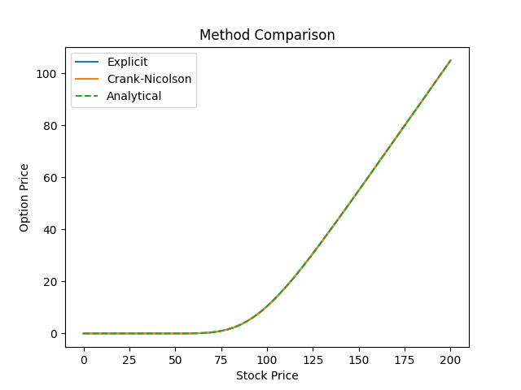
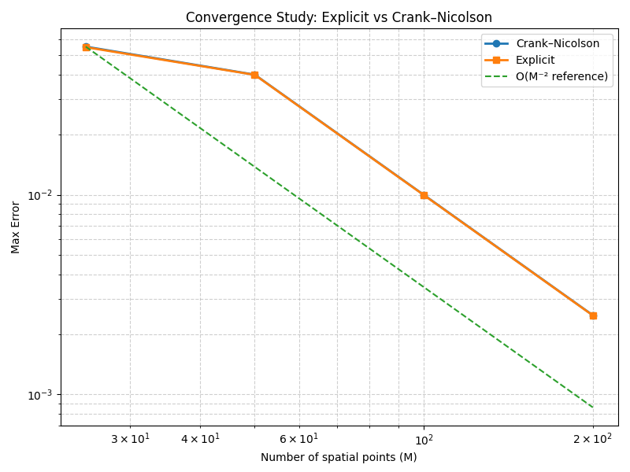

# Black–Scholes PDE Solver

Finite difference solver for European option pricing using the Black–Scholes equation.

---

## Overview

This project implements numerical methods to solve the Black–Scholes partial differential equation (PDE) for a European call option.

Two schemes are implemented:

- Explicit finite difference scheme
- Crank–Nicolson scheme (implicit, second-order accurate)

The numerical solutions are validated against the analytical Black–Scholes formula, and a convergence study is performed.

---

## Mathematical Model

The Black–Scholes PDE is:

∂V/∂t + 0.5 σ² S² ∂²V/∂S² + r S ∂V/∂S − r V = 0

Terminal condition:

V(S, T) = max(S − K, 0)

Boundary conditions:

- V(0, t) = 0
- V(S_max, t) ≈ S_max − K e^{-r(T−t)}

---

## Numerical Methods

### Explicit Scheme

- Forward in time, central in space
- Simple to implement
- Conditionally stable (requires small time step)

### Crank–Nicolson Scheme

- Implicit method (solves linear system at each time step)
- Second-order accurate in time and space
- Unconditionally stable

---

## Validation

The numerical solutions are compared with the analytical solution of the Black–Scholes formula.

### Price comparison



### Error comparison


---

## Convergence Study

A convergence study is performed to analyze how the error decreases as the grid is refined.

### Key Result

Both schemes exhibit second-order convergence with respect to spatial resolution:

Error ~ O(ΔS²)

This is confirmed by log-log plots of error vs grid size.

---

## Important Insight

Two numerical regimes are observed:

### 1. Fine time discretization

When the time step is sufficiently small:

- Both explicit and Crank–Nicolson schemes show similar errors
- The error is dominated by spatial discretization



👉 In this regime:
Explicit ≈ Crank–Nicolson

---

### 2. Coarse time discretization

When using larger time steps:

- Crank–Nicolson remains stable and accurate
- Explicit scheme becomes unstable or inaccurate

👉 This highlights the key advantage of Crank–Nicolson:
it allows larger time steps while maintaining accuracy

---

## Usage

### Install dependencies

```bash
pip install -r requirements.txt